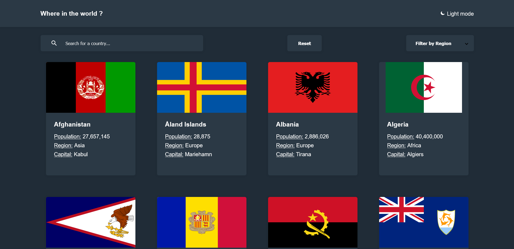

# Frontend Mentor - REST Countries API with color theme switcher solution

This is a solution to the [REST Countries API with color theme switcher challenge on Frontend Mentor](https://www.frontendmentor.io/challenges/rest-countries-api-with-color-theme-switcher-5cacc469fec04111f7b848ca). Frontend Mentor challenges help you improve your coding skills by building realistic projects. 

## Table of contents

- [Overview](#overview)
  - [The challenge](#the-challenge)
  - [Screenshot](#screenshot)
  - [Links](#links)
- [My process](#my-process)
  - [Built with](#built-with)
  - [What I learned](#what-i-learned)
  - [Useful resources](#useful-resources)
- [Author](#author)

## Overview

### The challenge

Users should be able to:

- See all countries from the API on the homepage
- Search for a country using an `input` field
- Filter countries by region
- Click on a country to see more detailed information on a separate page
- Click through to the border countries on the detail page
- Toggle the color scheme between light and dark mode *(optional)*

### Screenshot

### Links

- Solution URL: [Submited on FM](https://www.frontendmentor.io/solutions/es6-class-intersectionobserver-js-module-localstorage-uCDn7nJvC)
- Live Site URL: [Github Page](https://suleeyman.github.io/FM-8-CountryAPI)

## My process

### Built with

- SCSS
- Async/Await Native JS
- JS Module
- LocalStorage API
- Rest country API
- JS ES6 class
- IntersectionObserver

### What I learned

I learned: 
  - How to implement module in native JS
  - How to use ES6 class in JS
  - Store data in the localStorage to be used on a new HTML Page
  - How to implement a Light/Dark mode dynamically
  - Dynamic observer according to the screen

### Useful resources

- [Module in ES6](https://www.youtube.com/watch?v=s9kNndJLOjg) - This helped me for module in JS.
- [Dark/Light mode with SCSS](https://dev.to/ananyaneogi/create-a-dark-light-mode-switch-with-css-variables-34l8) - This is an amazing article which helped me for dark/light mode.

## Author

- Frontend Mentor - [@suleeyman](https://www.frontendmentor.io/profile/suleeyman)